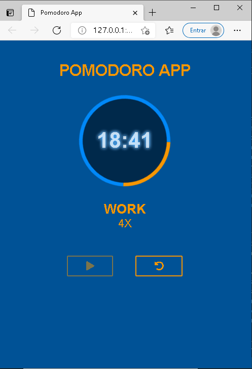
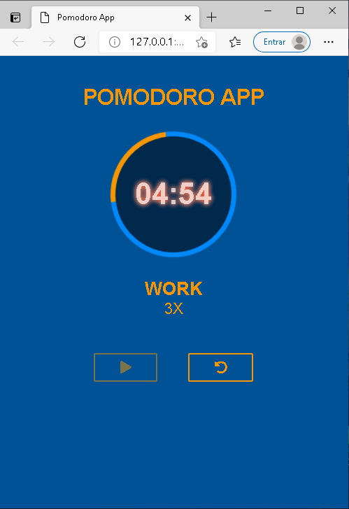

# Pomodoro-App

Uma aplicação que faz uso da técnica Pomodoro que é um método de gerenciamento de tempo e produtividade

<h3>Recursos</h3>
  <ul>
    <li>Cronometragem do tempo</li>
    <li>Marcações diferentes para o tempo de traalho e descanso</li>
    <li>Contagem dos ciclos de trabalho (work)</li>
    <li>Uso da biblioteca Moment.js para minupulação de minutos/segundos</li>
    <li>Animação da barra circular</li>
    <li>Botão para iniciar o pomodoro</li>
    <li>Botão de Reset para iniciar ou reiniciar um novo pomodoro</li>
    <li>Cada vez que o ciclo trabalho/descanso termina é tocado um aúdio avisando</li>
  </ul>
  
  <h3>Screenshot</h3>
    <h4 align="center">
      
    </h4>
    <h4 align="center">
      
    </h4>
